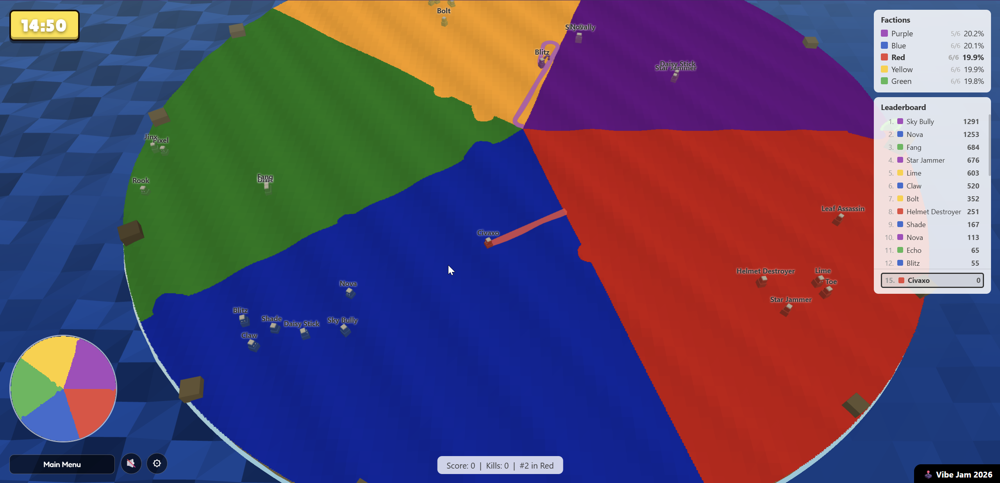

# Land Capture

A territory war set on a wavy island. Five teams fight for control of the island. Capture the most land in a 15-minute team battle. Solo against bots, or online with real players.

<p align="center">
  
</p>

**Play it now**
- Web (canonical, Railway): https://landcapture.up.railway.app/
- Web (mirror, itch.io): https://civax.itch.io/land-capture

This is my entry for **[Vibe Jam 2026](https://vibej.am/2026/)** 

The Vibe Jam rules dictated 90% minimum of the game must be done using AI, and no loading screens. 
I made the game using Claude Code with my own framework of skills, I made the music using Suno AI and all art assets were generated in the code.

Feel free to contact me for any questions: [@civaxo](https://x.com/civaxo) on Twitter (X).

---

## How to play

- Move - **WASD** / **arrow keys** or **mouse** steering 
- Zoom - **Mouse wheel** 
- Leaderboard - **Tab** 
- Pause music / open settings - UI buttons (top-right) 

### The basics

- Leave your home territory to draw a colored trail behind you.
- Close the loop back onto your own color to capture the enclosed land.
- Cross another player's trail and they die. Stand on enemy land without a trail and *you* die.
- Die → respawn 3 seconds later in your team's territory with a 5-second invulnerability shield.

### Scoring

- **+1** per cell captured · **+50** per claim · **+500** per kill
- **−4%** penalty on each death
- **1.25×** multiplier while your faction is **Endangered** (under 10% of the island)
- End-of-round team bonus: **1st +20%**, **2nd +10%**, **3rd +5%**

### Round flow

- 15 minutes per round, 30 seconds intermission, then a fresh round auto-starts.
- Players in Eliminated factions get reassigned to surviving teams.
- Whoever holds the most land at time-zero wins, or if a single faction eliminates all the others before that.

### Top-player icons (live)

- ⚔️ **Top Killer**
- 🏆 **Top Land Grabber**
- 🛡️ **Top Survivor**

---

## Tech stack

- Renderer: [Three.js](https://threejs.org/) (importmap from CDN — no bundler) 
- Multiplayer transport: [Colyseus](https://colyseus.io/) 0.16 (WebSocket + Schema 3.x) 
- Server: Node 20 + Express, TypeScript via `tsx` 
- Simulation: Pure JS, shared between client (solo) and server (online) 
- Build / monorepo: pnpm v10 workspaces, no bundler 
- Tests: Vitest 
- Analytics: better-sqlite3 (WAL) + db-ip GeoLite (country-level) + Chart.js dashboard 
- Container: Multi-stage Dockerfile, `node:20-alpine` 
- Hosting (canonical): Railway (one container, persistent volume for stats DB) 
- Hosting (mirror): itch.io (static ZIP of `prototype/`, online points back to Railway) 

**Architecture in one sentence:** server-authoritative 30 Hz Colyseus simulation in Node, broadcast as Schema deltas to a Three.js renderer that also runs the same simulation locally for solo mode — same code, two hosts.

---

## How the code fits together

The repo is intentionally small and bundler-free. Roughly:

- **`prototype/`** is the entire game client. It's plain ES modules served as static files — no bundler, no transpile step, no build artifacts. `index.html` declares an importmap that pulls Three.js and `colyseus.js` from a CDN, then loads `main.js` directly. You can open it from any static host.
- **`prototype/sim/`** is the **simulation core**: pure JavaScript, no Three.js, no DOM, no I/O. Every game mechanic lives here — movement, claims, kills, scoring, bot AI, faction territory, the match clock. Both the in-browser solo mode and the Node multiplayer server tick *the exact same files*.
- **`prototype/main.js`** is the renderer + input layer. It owns the Three.js scene, the camera, the HUD, the FX manager, and the mode glue (solo wires up a local `Simulation`; online wires up a `MultiplayerClient`). It never decides game state — it reads it.
- **`server/`** is a Colyseus + Express server. It owns the authoritative simulation tick at 30 Hz, broadcasts state via Colyseus Schema deltas, and serves the static client + the analytics dashboard from the same port.
- **`server/scripts/copy-sim.mjs`** is the trick that lets the same code run on both sides: at build time it copies `prototype/sim/` → `server/src/sim/`. The server imports from there. Edit at the source (`prototype/sim/`); the copy is gitignored.

### Data flow

**Solo mode**
```
Keyboard / mouse → main.js input → Simulation.tick() → renderer reads sim state → Three.js
```

**Online mode**
```
Keyboard / mouse → main.js input → MultiplayerClient.sendInput() ──websocket──▶ Server
                                                                               Server runs Simulation.tick() at 30 Hz
   Three.js ◀── renderer reads schema state ◀── Colyseus delta sync ◀────────  Server broadcasts schema
```

The simulation is **server-authoritative** in online mode. The client renders schema state plus a small client-side prediction layer for the local player (eliminates input round-trip lag; the server reconciles any drift via teleport events).

### What lives where

| Concern | File(s) |
|---|---|
| Game rules (movement, claim, kill, score) | `prototype/sim/Simulation.js`, `Character.js`, `scoring.js`, `match.js`, `faction.js`, `grid_geom.js` |
| Bot AI | `prototype/sim/BotAI.js` |
| Three.js scene + character meshes + FX | `prototype/main.js` |
| HUD (timer, leaderboard, factions panel, end screen) | `prototype/ui.js` |
| Multiplayer client | `prototype/multiplayer.js` |
| Vibe Jam portals | `prototype/portals.js` |
| Telemetry (sendBeacon → /track) | `prototype/telemetry.js` |
| Multiplayer room | `server/src/rooms/GameRoom.ts` |
| State schema (sync'd to clients) | `server/src/schema/GameState.ts` |
| Analytics ingest + dashboard + DB | `server/src/stats/*` |
| HTTP boot + CORS + Colyseus mount | `server/src/index.ts` |

### Key design decisions

- **No bundler.** The cost of adding Vite/esbuild outweighs the benefits at this scale: instant edits, trivial debugging, the `prototype/` folder works as a static site without any build.
- **One Node process serves everything** — game websocket, static client, telemetry endpoint, dashboard. Single Railway service, single Docker container, single domain. The CORS middleware lets itch.io iframes connect cross-origin.
- **Simulation lives in `prototype/`, not `packages/`.** It's the source of truth; the server copies from it. Avoids inventing a third workspace package and keeps the client edit-then-refresh loop fast.
- **Telemetry is opt-out by default.** No `/track` endpoint is hit if the user doesn't load `telemetry.js`; nothing is stored if `STATS_PASSWORD` is unset (dashboard returns 503 fail-closed). Country-level geo only; IPs are dropped after lookup.

---

## Repository layout

```
prototype/             # Static client — no bundler, served as-is
  index.html
  main.js              # Renderer, FX, HUD, mode glue
  multiplayer.js       # Colyseus client + itch host detection
  telemetry.js         # /track event queue (sendBeacon)
  portals.js           # Vibe Jam in/out portals
  ui.js                # HUD / leaderboard / end-screen
  sim/                 # Pure-JS simulation (auto-copied to server)
    Simulation.js, Character.js, BotAI.js, faction.js, scoring.js, match.js,
    grid_geom.js, constants.js
  music/bgm.mp3

server/                # Colyseus + Express
  src/
    index.ts           # Boot + Express + CORS for itch
    rooms/GameRoom.ts  # 30 Hz tick, hello/input handlers, schema sync
    schema/GameState.ts
    stats/             # SQLite + ingest + dashboard (basic-auth)
  scripts/copy-sim.mjs # Copies prototype/sim → server/src/sim at build time

scripts/pack-itch.sh   # Zip prototype/ for itch upload
Dockerfile             # Multi-stage build (Railway)
railway.toml           # Healthcheck + port config
```

---

## Running locally

Requires **Node 20** and **pnpm 10**.

```bash
pnpm install
pnpm dev:server         # Colyseus + static client on http://localhost:2567
```

Open http://localhost:2567/ in your browser. **Solo** runs entirely client-side; **Online** connects to the local Colyseus room.

### Optional environment variables

```bash
STATS_PASSWORD=<any>                 # required to expose /stats dashboard (fail-closed if unset)
STATS_DB_PATH=./.local-data/stats.db # SQLite path; defaults to /app/data/stats.db in container
PORT=2567                            # HTTP/WS port
```

The stats dashboard is at `/stats` (HTTP Basic Auth, password = `STATS_PASSWORD`). Empty until events accumulate.

### Tests

```bash
pnpm test                            # vitest
```

### Packaging for itch.io

```bash
bash scripts/pack-itch.sh
# → dist-itch/landcapture-itch.zip (≈3.3 MB)
```

The static client auto-detects when it's running in an itch.io iframe (`*.itch.zone` / `*.itch.io`) and points its multiplayer + telemetry calls at the canonical Railway URL. To target your own server instead, edit the meta tag in `prototype/index.html`:

```html
<meta name="game-remote-origin" content="https://your-server.example.com">
```

---

## Deploying to Railway

1. Connect the repo to a Railway service.
2. Add a **Volume** mounted at `/app/data` (1 GB tier is plenty).
3. Set env var **`STATS_PASSWORD`** to anything — required for `/stats`.
4. Push to `main`. The Dockerfile builds, downloads the db-ip GeoLite database, and starts.

Build time is ~45 seconds with cache; ~2 minutes cold (the native `better-sqlite3` compile is the slow step).

---

## Forking and hosting your own

You're welcome to fork this and run your own version. The codebase is small enough that getting it up on your own infrastructure should be easy.

### Step 1 — Fork and clone

```bash
gh repo fork LeanEntropy/captureArena --clone
cd captureArena
pnpm install
pnpm dev:server     # http://localhost:2567
```

Solo mode works immediately. Online mode connects to your local server.

### Step 2 — Make it yours

A few touch points to find/replace:

| File | What |
|---|---|
| `prototype/index.html` | Page `<title>`, the title-screen text ("LAND CAPTURE", "CLAIM · HOLD · DOMINATE"), the "A game by" byline + X link |
| `prototype/sim/faction.js` | `FACTION_COLORS` and `FACTION_NAMES` if you want different teams |
| `prototype/sim/constants.js` | `ARENA_RADIUS`, `PLAYER_SPEED`, `BOT_SPEED`, `BOT_NAMES` etc — game tuning |
| `prototype/music/bgm.mp3` | Replace with your own (and update `CREDITS.md`) |
| `prototype/index.html` `<meta name="game-remote-origin">` | Set to your own server URL — see Step 4 |
| `CREDITS.md` | Add yourself; keep the third-party attributions |

### Step 3 — Deploy the server

The repo is preconfigured for **Railway**, but any Node-friendly host works (Fly.io, Render, a VPS, your own Docker host).

**On Railway:**
1. Push your fork to GitHub and connect it to a Railway service.
2. Add a **Volume** mounted at `/app/data` (1 GB tier is free).
3. Set env var `STATS_PASSWORD` to anything (required for `/stats` to be accessible).
4. Push to `main`. The Dockerfile handles the rest (db-ip download, `better-sqlite3` native compile).

**Anywhere else:** the Dockerfile at the repo root is portable. The container needs:
- Network access to download `https://download.db-ip.com/free/dbip-country-lite-YYYY-MM.mmdb.gz` at build time (or pre-download and `COPY` it).
- A persistent volume mounted somewhere; pass it via `STATS_DB_PATH=/your/path/stats.db`.
- `PORT` env to bind the HTTP+WS server.

### Step 4 — Point the static client at your server

Once your server is running at e.g. `https://yourgame.example.com`, edit one line in `prototype/index.html`:

```html
<meta name="game-remote-origin" content="https://yourgame.example.com">
```

The static client uses this when it's served from a *different* host than the game server (itch.io iframe, GitHub Pages, etc). When served from your own server it ignores the meta tag and uses `location.host` directly.

### Step 5 — Publish the static client (optional)

If you also want an itch.io / GitHub Pages mirror that points at your server:

```bash
bash scripts/pack-itch.sh
# → dist-itch/landcapture-itch.zip
```

Upload the ZIP to itch (Kind: HTML, "play in browser", viewport 1280×720). The same client works simultaneously from your domain *and* from itch — both connect back to your Colyseus server.

### Step 6 — Get into the Vibe Jam webring (optional)

The portals in `prototype/portals.js` are wired to the Vibe Jam 2026 webring spec. If you submit your fork to [vibej.am](https://vibej.am/2026/), incoming portal players land at your start portal and exiting players hop to other webring entries. The portal logic auto-handles the in/out via the `?portal=true&ref=<host>` query param contract.

### What to think about before flipping public

- **Music license.** Replace or attribute. The bgm shipped here is original (Suno-generated, by Civax) — not a sample library.
- **Stats dashboard password.** `STATS_PASSWORD` must be set and non-trivial; the dashboard reveals every event you've ingested.
- **Cookies / privacy.** The telemetry stores an anonymous `playerToken` in `localStorage` and (server-side) a country code — verify that's compatible with your jurisdiction.
- **Server abuse.** The Colyseus room accepts open WebSocket connections. If you scale beyond hobbyist traffic, add rate-limiting (`express-rate-limit` is already a small drop-in for `/track`).

---

## Credits

Game, code, and art direction: **Ohad Barzilay (Civax)** — [@Civaxo](https://x.com/Civaxo)
Music: *"Coffee Gives Me Superpowers (Instrumental)"* — composed with [Suno](https://suno.com)
Gameplay inspirations: **Paper.io 2** + **Tanks 3D io**
AI pair-programming: Anthropic Claude Code

Full credits and third-party licenses in [`CREDITS.md`](CREDITS.md).

---

## License

[Apache 2.0](LICENSE). Each third-party dependency retains its own license.

---

*Built for [Vibe Jam 2026](https://vibej.am/2026/) — find more entrants at the webring.*
